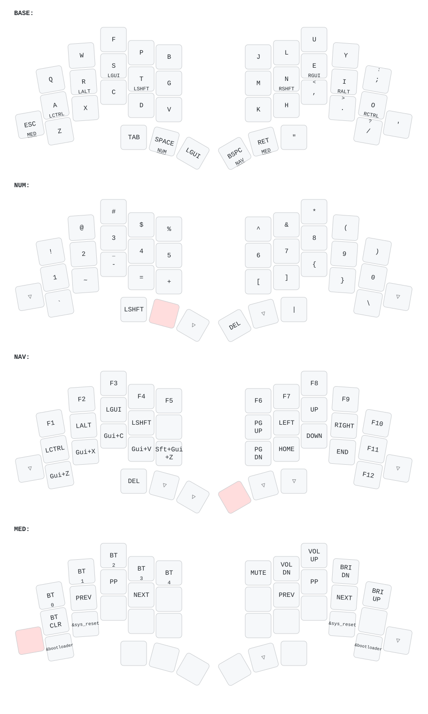

# ZMK Config - Totem Colemak-DHm (macOS)

Colemak-DHm layout optimized for Mac with home row mods and 4 layers.

## Layout



**Legend:**
- ▽ = Transparent (uses key from base layer)
- Home row mods (hold): Left = A:Ctrl, R:Opt, S:Cmd, T:Shift | Right = N:Shift, E:Cmd, I:Opt, O:Ctrl
- Arrow keys on NAV layer (+ formation): N=←, E=↑, I=→, H=↓

## Common Shortcuts

### Clipboard
- **Copy**: Thumb Cmd + C (or hold S + tap C)
- **Paste**: Thumb Cmd + V (or hold S + tap V)
- **Cut**: Thumb Cmd + X (or hold S + tap X)
- **Undo**: Thumb Cmd + Z (or hold S + tap Z)

### App Switching
- **Cmd+Tab**: Thumb Cmd + hold Space (L1) + tap Tab
- **Cmd+Q**: Thumb Cmd + Q

### Text Editing
- **Cmd+A**: Thumb Cmd + A
- **Cmd+S**: Thumb Cmd + S
- **Cmd+F**: Thumb Cmd + F
- **Shift+Letter**: Hold N (right Shift) + tap letter

### Navigation
- **Arrows**: Hold Backspace + tap N/E/I/H (←/↑/→/↓)
- **Word navigation**: Hold Backspace + hold I (Opt) + tap N/I (←/→)

## Bluetooth Pairing

1. Press **BT1-BT5** to select profile (Layer 3)
2. Keyboard enters pairing mode
3. Pair with your device
4. Switch profiles by pressing BT1-BT5

**Clear all pairings**: Press **BT Clear** (Layer 3)

## Firmware Updates

1. Press **Boot** key (Layer 3) to enter bootloader mode
2. Keyboard appears as USB drive
3. Drag `.uf2` file to the drive
4. Keyboard auto-resets with new firmware

## Building Firmware

### GitHub Actions (Recommended)

Firmware is built automatically via GitHub Actions on push.

Download from: **Actions** → Latest workflow → **Artifacts** → `firmware.zip`

### Local Build

Build locally using Docker:

```bash
./build-local.sh
```

This will generate:
- `build/totem_left.uf2`
- `build/totem_right.uf2`

**Requirements:**
- Docker installed and running
- First build will take ~10 minutes (downloads dependencies)
- Subsequent builds are faster (~2-3 minutes) due to caching

## Flashing Firmware

1. **Connect the keyboard** via USB-C
2. **Double-press the reset button** on the top side
3. **A USB drive will appear** on your computer
4. **Drag the corresponding `.uf2` file** into it
5. **The keyboard will flash and reboot** automatically

**Note:** Flashing the left half is usually enough. Flash both halves if some changes don't take effect.

## Credits

- Keyboard: [GEIGEIGEIST Totem](https://github.com/GEIGEIGEIST/TOTEM)
- Base config: [Keycoon/zmk-config-totem](https://github.com/Keycoon/zmk-config-totem)
